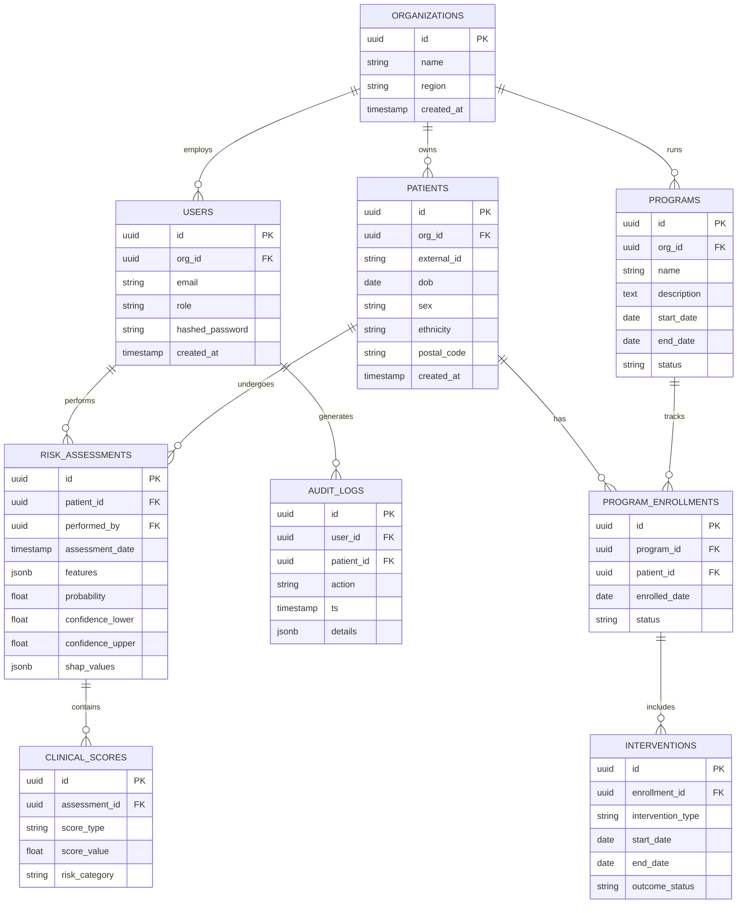

# Entity-Relationship Diagram

The PreventDM data model is organized into nine entities supporting multi-tenancy across public health units, longitudinal patient risk tracking, program management, and comprehensive audit logging.

## Entity groupings

The schema is organized into three logical groupings. The first grouping handles multi-tenancy and access control through ORGANIZATIONS, USERS, and AUDIT_LOGS. The second grouping handles the clinical core through PATIENTS, RISK_ASSESSMENTS, and CLINICAL_SCORES, with each patient capable of having multiple longitudinal risk assessments. The third grouping handles program management through PROGRAMS, PROGRAM_ENROLLMENTS, and INTERVENTIONS.

## Diagram

## Design notes

The features and SHAP values in the RISK_ASSESSMENTS table are stored as jsonb columns rather than being normalized into separate tables, because the feature set is relatively wide and may evolve as the model is updated. The CLINICAL_SCORES table is normalized as a child of RISK_ASSESSMENTS rather than denormalized into the assessment itself, which allows the set of supported scores to grow over time without schema migrations. The PATIENTS table includes postal_code and ethnicity to support geographic and demographic stratification for population analytics, with the postal_code captured at the forward sortation area level rather than the full postal code to reduce reidentification risk. The AUDIT_LOGS table captures every meaningful action with a jsonb details field that holds context-specific information, supporting both PHIPA compliance and quality improvement analysis.